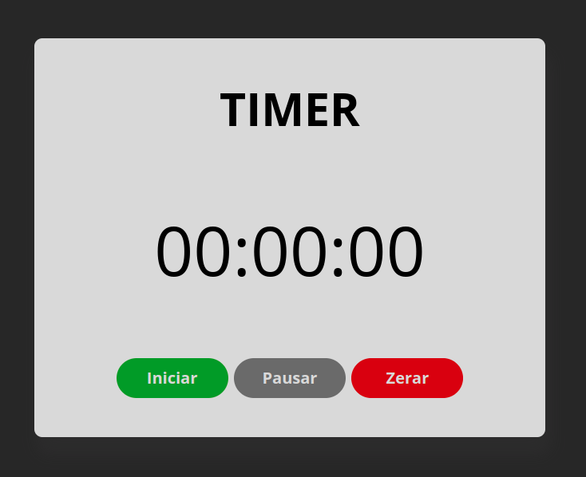

# ⏰ Timer

<h3 align="center"> 🚀 Timer ☀️ Concluído ✅ </h3>

<p align="center">
   <a href=#sobre>Sobre</a> •
   <a href=#site>Site</a> •
   <a href=#clone>Clone</a> •
   <a href=#layout>Layout</a> •
   <a href=#tecnologias>Tecnologias</a> • 
   <a href=#licença>Licença</a> •
   <a href=#autor>Autor</a> 
</p>

## 💻 Sobre
📱 Um timer simples que inicia o tempo, pausa e reseta

---

## 🌐 Site
<a href="https://vermillion-empanada-8efb96.netlify.app">📎 Clique aqui</a> 

---

## 📥 Clone
```bash
git clone https://github.com/Hashimoto1312/Timer.git
```

---

## 🎨 Layout


---

## 👾 Tecnologias


---

## 👨‍💻 Autor
 
 <br/>🚀 Kendi Hashimoto

[](https://linktr.ee/Hashimoto01)
[](https://www.linkedin.com/in/kendi-hashimoto-202359220/) 
[](https://mail.google.com/mail/u/0/#inbox)

---

## 📝 Licença
Este projeto esta sobe a licença [MIT](./LICENSE).